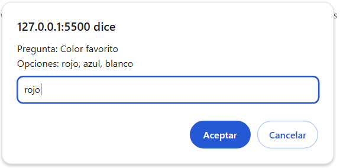

## PROYECTO 2: Sistema de votación con Javascript

### Descripción del Proyecto
Este proyecto implementa un sistema de votación utilizando JavaScript, aplicando los principios de Programación Orientada a Objetos (POO) y Programación Funcional (PF). El sistema permite a los usuarios:

1. Crear encuestas dinámicamente, agregando preguntas con opciones de respuesta.
2. Votar en las encuestas mediante una interacción sencilla.
3. Mostrar los resultados acumulados de las votaciones de forma clara.
4. Garantizar que las encuestas contengan al menos 8 preguntas.
5. Almacenar las preguntas y los votos en estructuras organizadas para fácil manipulación.

---

### Funcionalidades Principales
1. **Crear preguntas dinámicas:**
   - Solicita al usuario ingresar el texto de la pregunta y las opciones de respuesta.
   - Asegura que haya un mínimo de 8 preguntas en cada encuesta.

2. **Registrar votos:**
   - Permite a los usuarios seleccionar una opción válida para cada pregunta.
   - Almacena los votos en un objeto asociado a cada pregunta.

3. **Mostrar resultados:**
   - Imprime en consola los resultados acumulados, mostrando cada opción con su respectivo conteo de votos.

4. **Validaciones:**
   - Verifica que las opciones seleccionadas sean válidas.
   - Agrega preguntas dinámicamente si el número inicial es menor a 8.

---

### Imágenes del Funcionamiento

#### 1. Creación de preguntas

#### 2. Opciones de la pregunta

#### 3. Responder la encuesta

#### 4. Resultados de la votación

---

### Tecnologías Utilizadas
- **JavaScript**: Lenguaje de programación principal.
- **POO y PF**: Estilos de programación para estructurar el sistema.

---

